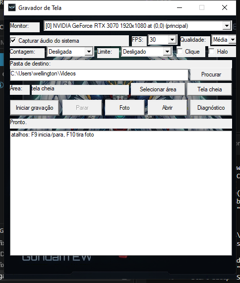
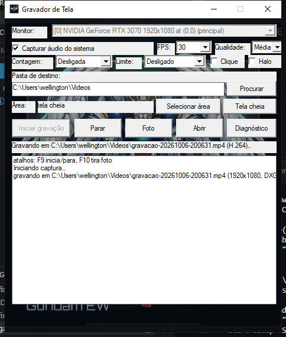

# Gravador de Tela

Gravador de tela para Windows 10/11 64-bit. Captura via DXGI Desktop
Duplication (fallback GDI BitBlt), codifica H.264 em MP4 pelo Media
Foundation — hardware (NVENC/QuickSync) quando a GPU oferece, software
inbox caso contrário — com fallback automático para Motion JPEG em AVI, e
mistura o áudio do sistema (loopback WASAPI). Interface em Win32 puro via
`syscall` e CLI headless; sem cgo, sem toolkit, sem runtime além do Go.



## Pipeline de gravação

```
DXGI Duplication / GDI ──BGRA──▶ MF H.264 (NV12) ──▶ MP4  (padrão)
                    ├─BGRA──▶ WIC JPEG ──▶ AVI             (fallback)
WASAPI loopback ──PCM/float──▶ AAC ──▶ MP4 │ PCM ──▶ AVI
```

- **Captura.** `native/src/capture.cpp`: DXGI é preferido (textura GPU já com
  cursor composto); GDI entra quando a duplicação é recusada (VMs, sessões
  remotas) ou devolve frames vazios — verificado por `OpenVerified`, que
  troca para GDI se os primeiros frames forem uma cor só. Sessão presa a
  uma OS thread (`LockOSThread`), pois DCs e duplicação pertencem à thread
  criadora.
- **Vídeo.** `native/src/encoder_mf.cpp`: conversão BGRA→NV12 própria
  (BT.601 inteira), `IMFSinkWriter` com `NV12 in / H.264 out`, rate-control
  quality-VBR com teto de bitrate e retry CBR, device D3D + DXGI manager para
  engajar o encoder de hardware. Timestamps: `videoTime_ += 1/fps` por
  amostra; duração fixa de um frame.
- **Fallback.** `native/src/encoder.cpp`: um JPEG WIC por frame muxado por
  um writer AVI 1.0 próprio (sem OpenDML: limite de 4 GB). Todo JPEG é
  keyframe; offsets do `idx1` apontam para o campo de tamanho do chunk
  (convenção do ffmpeg, que o splitter do MF exige). Chunks vão direto ao
  disco; headers e índice são remendados no `finish()`.
- **Áudio.** `native/src/audio.cpp`: loopback no endpoint de render padrão
  (console → multimídia → qualquer endpoint ativo). Float32 vira S16 antes
  do AAC (MP4, 96 kbps); no AVI o PCM vai cru (`01wb`).
- **Ritmo.** `internal/rec/recorder.go`: ticker em 1/FPS faz
  `Grab(5 ms)` + `Encode`; timeout (desktop estático) repete o último frame
  para manter a timeline. O loop de áudio encaminha blocos e dorme 10 ms em
  `Timeout` para não girar um núcleo à toa.
- **Sincronia A/V.** Quando nada toca, o WASAPI não entrega nada e o relógio
  de áudio congelaria enquanto o vídeo avança — o sink writer do MP4 então
  estrangula o vídeo (cada `WriteSample` passa a bloquear ~1 s, o FPS
  desaba e o arquivo sai acelerado e curto). Por isso o `audioLoop` injeta
  **silêncio** em todo gap ≥ 100 ms (blocos de até 1 s): desktop quieto
  grava silêncio de verdade e os streams andam juntos.



## Qualidade e formato

| Controle  | Baixa      | Média (padrão) | Alta        |
|-----------|------------|----------------|-------------|
| Bitrate   | 400 kbps   | 650 kbps       | 1,2 Mbps    |
| Nível H.264 | 60       | 70             | 85          |

FPS: 15 / 30 / 60. Áudio AAC a 96 kbps no MP4. Contagem regressiva
(3/5/10 s), limite de gravação (5 min–2 h), região arbitrária, anel de
clique e halo do ponteiro assados nos pixels, foto PNG avulsa.

## Concorrência e ABI nativa

- Thread de UI presa (`LockOSThread`) com watchdog que despeja goroutines
  em `%TEMP%\gravador-ui-hang.txt` após 10 s muda; workers nunca tocam
  HWND — enfileiram closures drenadas via `WM_APP_DRAIN`.
- Fronteira Go↔C em `native/include/recorder_native.h` (ABI 3): C puro,
  structs com campo de tamanho, erros via `recorder_last_error`, carregada
  por `syscall.LoadDLL` — divergência de ABI vira erro comum, nunca
  falha de build.
- `locateLibrary` procura ao lado do exe → `bin\` → árvore de fontes, então
  `go run`/`go test` funcionam de qualquer diretório.

## Arquivo único

`recorder.exe` carrega DLL, ícones e fundo embutidos (`go:embed` — o
`go:embed` não alcança fora do próprio diretório, por isso o build copia
os artefatos para `internal/*/embedded/` antes de compilar):

- DLL extraída no primeiro run para a pasta do exe (fallback
  `%TEMP%\recorder_native-<hash>.dll` versionado se a pasta for
  só-leitura); só escreve quando o hash difere, nunca toca em DLL travada
  por outra instância.
- Ícones via `CreateIconFromResourceEx` direto nas entradas PNG do .ico;
  fundo via `CreateDIBSection` + cópia — nenhum arquivo temporário. A pasta
  `assets\` continua como fallback (útil para iterar na arte sem rebuild).

## Build

Ordem importa — exe e DLL sempre rebuildados juntos:

```powershell
# arte a partir de 2.png / 3.png (só ao trocar a arte)
powershell -ExecutionPolicy Bypass -File assets\make-icons.ps1
# DLL nativa (MSVC 2022, /O2 /GL) → bin\recorder_native.dll
powershell -ExecutionPolicy Bypass -File build.ps1
# exe single-file, subsystem GUI (sem console) → bin\recorder.exe
powershell -ExecutionPolicy Bypass -File build-exe.ps1 [-Go <go.exe>]
```

`build-exe.ps1` localiza o Go no PATH ou em `%TEMP%\opencode\go`. O manifesto
(`asInvoker` + compatibilidade Win10/11) vai via `recorder.syso`, gerado por
`goversioninfo` a partir de `cmd/recorder/versioninfo.json`
(+ flag `-manifest`).

## Uso

```
recorder                 # janela de controle (F9 grava/para, F10 foto)
recorder doctor          # backends, encoders, teste real de 30 frames
recorder record [flags]  # headless: --out --seconds --fps --display
                         #   --quality --bitrate --vquality --mjpeg --no-audio
recorder snapshot        # um PNG do display
```

Configuração em `%APPDATA%\GravadorDeTela\config.json` (pasta, áudio,
FPS, qualidade, countdown, limite, overlays, display).

## Estrutura

```
cmd/recorder/      entrada GUI+CLI, manifesto, version info
internal/app/      doctor / record / snapshot / run
internal/rec/      videoLoop + audioLoop + teardown, stats
internal/native/   ABI via syscall + extração do embed
internal/ui/       Win32: janela, tray, hotkeys, região, fundo, log
native/src|include/ C++: capture, encoder_mf, encoder (AVI), audio, devices
assets/            .ico + bg.bmp gerados por make-icons.ps1
docs/              prints da interface
bin/               saída do build
```

## Distribuição e antivírus

Exe novo e sem assinatura cai no SmartScreen ("editor desconhecido" →
Mais informações → Executar assim mesmo) e pode sofrer falso positivo:
captura de tela + hotkeys globais + polling de tecla + extração de DLL em
runtime são comportamentos que a heurística marca. Caminhos legítimos:
certificado de código (OV/EV; auto-assinado não adianta), submissão do
falso positivo em `microsoft.com/en-us/wdsi/filesubmission`, e distribuir
exe+DLL lado a lado (o extrator vê o hash igual e não escreve nada).
Nunca use packers (UPX etc.) — pioram a detecção.

## Solução de problemas

- Comece por `recorder doctor`: ele lista displays, backend, encoders e
  grava 30 frames de teste em cada caminho.
- Sem H.264 na máquina, cai para Motion JPEG automaticamente (nota no log).
- `duplication is silent... GDI fallback`: esperado em VM/remoto.
- MP4 truncado sem `moov` (processo morto no meio) não abre; o AVI, por
  ter os dados em streaming + patch no fim, costuma ao menos exibir algo.
